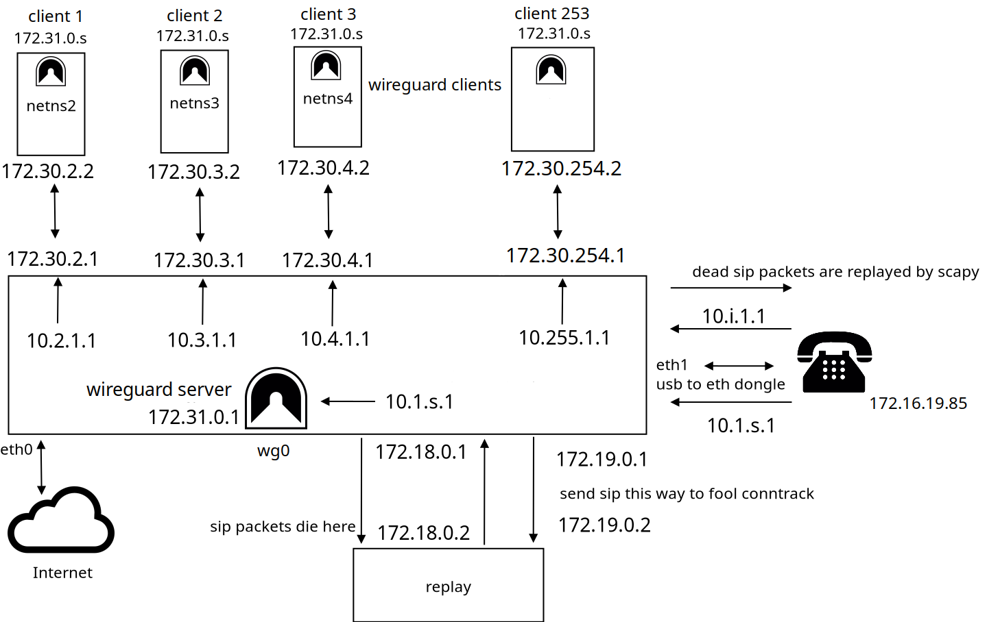

# voider_2

Direct Ip Calls, wich are ip agnostic.\
srtp is natively supported by the phones.\
the private phone number on the phone itself is always : **172.16.19.85/30**\
the gateway is always : **172.16.19.86/30**.

(agnostic in the sense that on the good old phones you did not know who was calling you,\
because old phones don't have a display. So it's _i got to hear it to believe it_ you will\
see the call incoming from a specific fake ip address but you may or may not map that to\
the callers ip address. So perhaps anonymous phone calls is a better term :)

Disclaimer : 
You need to already be using a linux machine to set this up.
You need to know how to ssh into a linux machine to set this up.
After all is done this raspi will be a device to be thought of like the good old phones,
as seen on the picture. This raspi will be a dedicated machine only for the phone.

**How to install** :

flash alpine linux :

dd if=alpine-rpi-3.20.3-aarch64.img of=/dev/sdX bs=4M

run setup-alpine

setup another user other than root, dhcp on eth0 is fine.

use the same micro sd card for the os (type mmcblk0).

git clone https://github.com/slave-blocker/voider_2.git

cd voider/voider

as user :

doas ./install.sh

as root :

(let it be wireguard, let quad9, no to ipv6 and at the end don't reboot, the script will do that for you)

./install_as_root.sh

**How to setup** :

~/$ cd .config/voider

choose interfaces :

(this will setup /etc/network/interfaces and then reboot)
(the phone needs to be connected already with the raspi)

doas ./main.sh

build the go-libp2p executable :

(run this as normal user, and then you will be asked for doas pass)

./main.sh

after reading "success" you should be good to go.

**How to use** :

Buy a Grandstream IP phone, that has a Direct ip call feature. (tested with GXP1610)

Install voider on a Raspberry Pi, or any Linux machine.

Connect a Grandstream phone to the usb dongle of your machine.

Run : 

doas ./main.sh

to create new clients or to connect to servers.
  
Once connections exist to servers or clients,
go to the phone and DIRECT IP CALL : 

10.1.2.1 ---> 1st client

10.1.3.1 ---> 2nd client 

10.1.4.1 ---> 3rd client

etc

10.2.1.1 ---> 1st server 

10.3.1.1 ---> 2nd server 

10.4.1.1 ---> 3rd server

etc

_Out of the box Grandstream phones should use rtp, to enable srtp, access your phones web interface
and go to account -> audio settings and put srtp -> Enabled and forced_.

**There is no pbx being used, instead sip packets die before getting to the callee.
And then some deep packet inspection happens. Replacing the 172.16.19.85 by a fake address.
The packet is then replayed, by scapy and tcprewrite, towards the callee phone.**

**Note**
golang uses https://go.dev/blog/gotelemetry

to switch that off :

go telemetry off

To connect two devices over go-libp2p takes sometimes a lot of time. After two devices have announced
themselves long enough over the kad-dht, it is rather quick to reconnect if your router changes it's dynamic ip.
The go executable is around 40 MB in size, and during the search and connect procedure, the listening port of your raspi
transmits a lot of data... 

run :

du -hs $(go env GOCACHE)

sometimes this has up to 341 MB ! (the alpine linux image is only 90 MB)

do also :

go clean -cache

to clean ~/.cache/go-build

If you are not ok with these aspects of go-libp2p, use first version of voider.

Please do contact me for critics, suggestions, questions, kudos, and even mobbing attempts are welcome.

@ irc   **monero-pt**

special thanks to Andreas Hein !

A do nation is the best nation !

**MONERO** :

